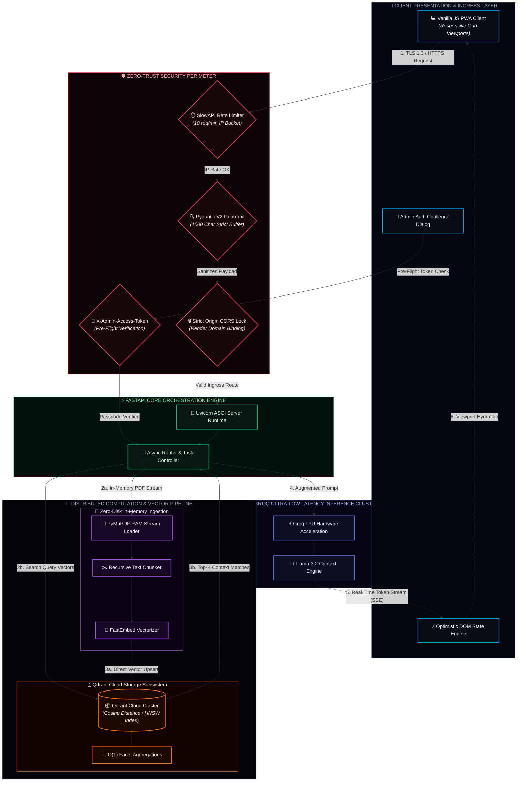

#  Saudi Vision 2030: Policy Intelligence Pipeline

> An enterprise-grade, cyber-resilient Retrieval-Augmented Generation (RAG) microservice built for real-time document intelligence, featuring zero-disk ingestion, $O(1)$ telemetry, rate-limited inference, and multi-layered defense-in-depth security.

[](https://fastapi.tiangolo.com)
[](https://qdrant.tech)
[-F97316.svg?style=flat)](https://groq.com)
[](#-defense-in-depth-security-matrix)
[](https://render.com)

---

## 📐 System Architecture

The pipeline processes high-density policy PDFs completely in-memory, converts structural content into dense vector embeddings using cosine distance matching, and serves streaming responses through an isolated, authenticated API layer.

$$\text{Cosine Similarity: } \cos(\theta) = \frac{\mathbf{A} \cdot \mathbf{B}}{\|\mathbf{A}\| \|\mathbf{B}\|}$$



---

## 🔥 Key Engineering Highlights

### ⚡ 1. Zero-Disk RAM-Bound Ingestion Pipeline
* **Stateless Processing:** Documents are processed directly in memory via `PyMuPDFLoader` byte streams without writing transient files to server disk.
* **Low Latency:** Eliminates disk I/O bottlenecks during vectorization, ensuring maximum throughput and instant cleanup upon container termination.
* **$O(1)$ Telemetry:** Real-time collection metrics and vector counts are queried directly through Qdrant facet aggregations with zero database re-indexing penalties.

### 🛡️ 2. Pre-Flight Auth & Optimistic UI
* **Synchronous Pre-Flight Lock:** Native client-side actions trigger an immediate `GET /api/documents/auth` validation step prior to updating client state.
* **Deferred Deletion Execution:** Validated actions engage a 10-second non-blocking deferred execution queue with full undo capabilities, maintaining telemetry synchronization between DOM state and vector storage.

### 📱 3. Mobile-First Responsive Design
* **Adaptive Viewport Breakpoints:** Dynamic transformation from multi-column analytics grids ($>768\text{px}$) to single-column stacked mobile layouts ($<768\text{px}$).
* **Ergonomic Touch Targets:** Minimum 44px touch targets across sticky input bars, quick-query chips, and off-canvas slide-out session menus.

---

## 🔒 Defense-in-Depth Security Matrix

| Security Layer | Mechanism | Implementation Detail |
| :--- | :--- | :--- |
| **Boot Validation** | Fail-Fast Environment Check | Executes `sys.exit(1)` on startup if `GROQ_API_KEY`, `QDRANT_URL`, or `QDRANT_API_KEY` are missing. |
| **Origin Protection** | Strict CORS Binding | Rejects all origins except explicit application production endpoints and local dev ports. |
| **DDoS Prevention** | SlowAPI Rate Limiting | Enforces `@limiter.limit("10/minute")` tracking client remote IP addresses (`get_remote_address`). |
| **Payload Hardening** | Pydantic Schema Guards | Enforces `max_length=1000` on input parameters to block buffer exhaustion and prompt-injection vectors. |
| **Cryptographic Lock** | Token Header Validation | Protects destructive endpoints (`DELETE /api/documents/{id}`) behind mandatory `X-Admin-Access-Token` checks. |

---

## 🛠️ Tech Stack & Dependencies

* **Backend Framework:** FastAPI (Python 3.11+)
* **Vector Database:** Qdrant Cloud Cluster
* **LLM Orchestration:** Groq API (`llama-3.2-90b-vision-preview` / `llama-3.1-8b-instant`)
* **Document Parsing:** PyMuPDF (`fitz`)
* **Rate Limiting:** SlowAPI / Starlette
* **Frontend:** Vanilla JavaScript (ES6+), Modern CSS3 (CSS Grid/Flexbox), Chart.js
* **Deployment:** Render PaaS (Automated CD via GitHub Sync)

---

## 🚀 REST API Specification

### Inference & Querying

#### `POST /api/chat`
Stream LLM policy analysis responses using Server-Sent Events (SSE).
* **Rate Limit:** 10 requests / minute
* **Payload:**
```json
{
  "message": "What are the primary targets for non-oil GDP growth in Vision 2030?",
  "session_id": "sess_88329"
}
```

### Document Management & Auth

#### `GET /api/documents/auth`
Pre-flight passcode verification step for administrative actions.

* **Headers:** `X-Admin-Access-Token: <ADMIN_PASSPHRASE>`

**Response (200 OK):**
```json
{
  "authenticated": true,
  "status": "access_granted"
}
```

#### `DELETE /api/documents/{document_id}`
Permanently purges vector embeddings associated with a specific document payload from Qdrant Cloud.

* **Headers:** `X-Admin-Access-Token: <ADMIN_PASSPHRASE>`

**Response (200 OK):**
```json
{
  "status": "success",
  "message": "Document vectors successfully purged."
}
```

---

## 💻 Local Setup & Development

### 1. Clone Repository
```bash
git clone https://github.com/muhammad-hameed-ai/saudi-vision-2030-rag.git
cd saudi-vision-2030-rag
```

### 2. Configure Environment Variables
Create a `.env` file in the root directory:
```env
GROQ_API_KEY=gsk_your_groq_api_key_here
QDRANT_URL=https://your-cluster.qdrant.tech:6333
QDRANT_API_KEY=your_qdrant_api_key_here
ADMIN_PASSPHRASE=3331604
```

### 3. Install Dependencies
```bash
python -m venv venv
source venv/bin/activate  # On Windows: venv\Scripts\activate
pip install -r requirements.txt
```

### 4. Run Development Server
```bash
uvicorn src.api:app --reload --port 8000
```
Access the dashboard locally at `http://localhost:8000`.

---

## 📜 License
Distributed under the MIT License. See `LICENSE` for details.
