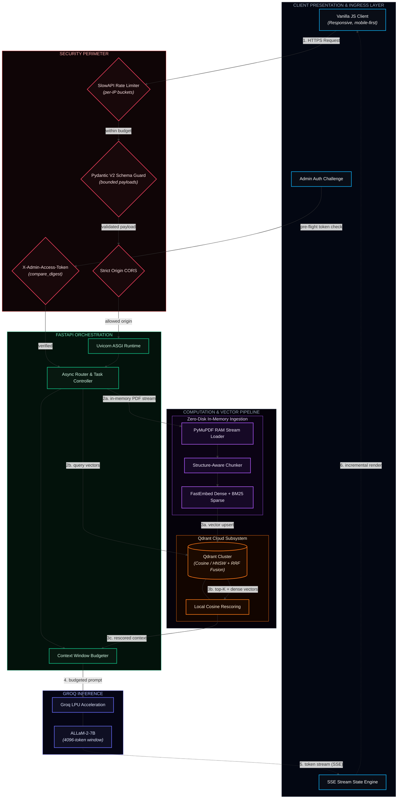

# Saudi Vision 2030: Policy Intelligence Pipeline

> A production-grade Retrieval-Augmented Generation service for Saudi policy documents, engineered to run inside a 512 MB / 0.1 CPU envelope. Hybrid dense + sparse retrieval, true cosine relevance scoring, context-window budgeting, and streaming inference — with every reported metric measured rather than asserted.

[](https://fastapi.tiangolo.com)
[](https://qdrant.tech)
[-F97316.svg?style=flat)](https://groq.com)
[](https://python.org)
[](https://render.com)

**Live:** [saudi-vision-2030-rag-3.onrender.com](https://saudi-vision-2030-rag-3.onrender.com)

---

## The engineering problem

Running a hybrid RAG pipeline on Render's free tier means fitting embedding inference, vector search, conversation memory, and LLM streaming into **512 MB of RAM and 0.1 CPU**, on a container that sleeps after 15 minutes and has no persistent disk.

Most of the interesting decisions in this codebase exist because of that ceiling. The sections below document what broke, why, and what the fix measured.

### Memory: bypassing the cross-encoder

Loading FastEmbed's dense and sparse models alongside an ONNX cross-encoder reranker peaked near **700 MB** and the OS killed the process mid-request. The reranker is now bypassed and retrieval candidates pass directly to the LLM, holding steady usage near **300 MB**. The module is retained for a future paid tier; `/api/pipeline-info` reports it as disabled rather than claiming it is active.

### Relevance: RRF scores are not similarity

Qdrant's `FusionQuery` returns a Reciprocal Rank Fusion score — `sum(1/(60+rank))` — which depends **only on rank position**. Position one scored 0.6225 whether the passage was perfect or irrelevant, so every displayed confidence figure was a rank artefact.

Dense vectors are now requested on the same round trip (`with_vectors`) and true cosine similarity is computed locally, at no additional query cost.

Ordering is a separate question from scoring, and the two use different signals deliberately. Results stay in **RRF fusion order**; an earlier revision re-sorted them by cosine, which measured worse at every depth because RRF fuses the dense *and* sparse rankings while cosine sees only the dense one:

| ordering | p@1 | p@3 | p@5 |
| :--- | ---: | ---: | ---: |
| RRF fusion (current) | **0.320** | **0.367** | **0.370** |
| cosine | 0.260 | 0.293 | 0.330 |

Cosine remains the displayed confidence figure, because it is a real similarity measure — the RRF score is a rank artefact and would be meaningless there.

| Query | Before | After |
| :--- | ---: | ---: |
| "PIF's role" — highly relevant | ~60% | **86.3%** |
| "NEOM renewables" — relevant | ~60% | **67.6%** |
| "capital of France" — off-topic | ~60% | **50.7%** |

### Context: budgeting a 4096-token window

`allam-2-7b` exposes a 4096-token window shared between prompt and completion. At `k=10` the retrieved context alone reached ~2,013 tokens while `max_tokens` reserved another 2,048 — 4,061 of 4,096, leaving nothing for the system prompt or conversation memory.

`_assemble_context()` now packs chunks against a computed budget and memory is bounded.

| Metric at `k=10` | Before | After |
| :--- | ---: | ---: |
| Time to first token | 34,805 ms | **1,119 ms** |
| Total response | 35,957 ms | **2,247 ms** |

### Retrieval: a keyword index cannot substring-match

The policy booster over-weights the core Vision 2030 documents to counteract term-frequency dominance from long financial circulars — two bond and sukuk prospectuses alone are **34% of the corpus**.

`metadata.source` must carry a **keyword** index, because the document registry facets on it and deletion filters it by exact value. Qdrant permits one index per field, so `MatchText` returned 400 on every query, and a later `MatchAny(["vision2030"])` silently matched **zero** documents — keyword matching is whole-value, and the stored values are full paths.

The working implementation resolves the actual filenames once via `facet()`, caches them, and matches those exactly. Adding a text index instead breaks the registry and deletion — verified empirically against the live cluster.

### Cold starts: an adaptive stream timeout

Free-tier containers sleep after 15 minutes. Measured cold start is **~52 s**, so the original flat 45 s frontend timeout guaranteed the first query after sleep always failed — and reported it as a backend crash. The first request of a page session now gets 120 s; subsequent requests stay at 45 s.

---

## System architecture


```mermaid
graph TB
    classDef clientZone fill:#090D16,stroke:#0EA5E9,stroke-width:2px,color:#F8FAFC;
    classDef securityZone fill:#18080A,stroke:#F43F5E,stroke-width:2px,color:#FFE4E6;
    classDef engineZone fill:#081810,stroke:#10B981,stroke-width:2px,color:#D1FAE5;
    classDef ramZone fill:#160926,stroke:#A855F7,stroke-width:2px,color:#F3E8FF;
    classDef vectorZone fill:#1C0A00,stroke:#F97316,stroke-width:2px,color:#FFEDD5;
    classDef llmZone fill:#0F0F23,stroke:#6366F1,stroke-width:2px,color:#E0E7FF;

    subgraph Ingress ["CLIENT PRESENTATION & INGRESS LAYER"]
        direction LR
        UI["Vanilla JS Client<br/><i>(Responsive, mobile-first)</i>"]:::clientZone
        State["SSE Stream State Engine"]:::clientZone
        AuthModal["Admin Auth Challenge"]:::clientZone
    end
    style Ingress fill:#030712,stroke:#1E293B,stroke-width:1px,color:#94A3B8;

    subgraph Security ["SECURITY PERIMETER"]
        direction TB
        RateLimit{"SlowAPI Rate Limiter<br/><i>(per-IP buckets)</i>"}:::securityZone
        Pydantic{"Pydantic V2 Schema Guard<br/><i>(bounded payloads)</i>"}:::securityZone
        CORS{"Strict Origin CORS"}:::securityZone
        HeaderAuth{"X-Admin-Access-Token<br/><i>(compare_digest)</i>"}:::securityZone
    end
    style Security fill:#0F0506,stroke:#EF4444,stroke-width:1px,color:#FCA5A5;

    subgraph ApplicationCore ["FASTAPI ORCHESTRATION"]
        direction TB
        ASGI["Uvicorn ASGI Runtime"]:::engineZone
        Router["Async Router & Task Controller"]:::engineZone
        Budget["Context Window Budgeter"]:::engineZone
        Router --> Budget
    end
    style ApplicationCore fill:#03120B,stroke:#10B981,stroke-width:1px,color:#6EE7B7;

    subgraph ComputeData ["COMPUTATION & VECTOR PIPELINE"]
        direction LR
        subgraph RAMEngine ["Zero-Disk In-Memory Ingestion"]
            direction TB
            PyMuPDF["PyMuPDF RAM Stream Loader"]:::ramZone
            Chunker["Structure-Aware Chunker"]:::ramZone
            FastEmbed["FastEmbed Dense + BM25 Sparse"]:::ramZone
            PyMuPDF --> Chunker --> FastEmbed
        end
        style RAMEngine fill:#0B0314,stroke:#A855F7,stroke-width:1px,color:#E9D5FF;

        subgraph VectorSubsystem ["Qdrant Cloud Subsystem"]
            direction TB
            Qdrant[("Qdrant Cluster<br/><i>(Cosine / HNSW + RRF Fusion)</i>")]:::vectorZone
            Cosine["Local Cosine Rescoring"]:::vectorZone
            Qdrant --- Cosine
        end
        style VectorSubsystem fill:#120500,stroke:#F97316,stroke-width:1px,color:#FFEDD5;
    end
    style ComputeData fill:#05020A,stroke:#334155,stroke-width:1px,color:#94A3B8;

    subgraph AIInference ["GROQ INFERENCE"]
        GroqEngine["Groq LPU Acceleration"]:::llmZone
        AllamModel["ALLaM-2-7B<br/><i>(4096-token window)</i>"]:::llmZone
        GroqEngine --- AllamModel
    end
    style AIInference fill:#050514,stroke:#6366F1,stroke-width:1px,color:#A5B4FC;

    UI -- "1. HTTPS Request" --> RateLimit
    RateLimit -- "within budget" --> Pydantic
    Pydantic -- "validated payload" --> CORS
    CORS -- "allowed origin" --> ASGI
    AuthModal -- "pre-flight token check" --> HeaderAuth
    HeaderAuth -- "verified" --> Router
    ASGI --> Router
    Router -- "2a. in-memory PDF stream" --> PyMuPDF
    Router -- "2b. query vectors" --> Qdrant
    FastEmbed -- "3a. vector upsert" --> Qdrant
    Qdrant -- "3b. top-K + dense vectors" --> Cosine
    Cosine -- "3c. rescored context" --> Budget
    Budget -- "4. budgeted prompt" --> GroqEngine
    AllamModel -. "5. token stream (SSE)" .-> State
    State -. "6. incremental render" .-> UI
```

---

## Retrieval pipeline

1. **Query normalisation** — regex typo correction and domain keyword expansion.
2. **Conditional HyDE** — queries of 8 words or fewer are expanded into a hypothetical answer before embedding. Longer queries carry enough signal on their own and skip the round trip, saving ~2 s.
3. **Hybrid search** — a 384-dim dense vector (`all-MiniLM-L6-v2`) and a BM25 sparse vector drive three parallel prefetches, fused by Reciprocal Rank Fusion.
4. **Cosine scoring** — dense vectors returned alongside results are scored locally for display. Ordering stays in RRF fusion order, which measures better than cosine order at every depth.
5. **Context budgeting** — the highest-scoring chunks are packed into the tokens remaining after the system prompt, conversation memory, and the reserved response allowance.
6. **Streaming synthesis** — tokens relay to the browser over SSE as Groq produces them.

---

## Measured performance

Production, with requests spaced to avoid upstream rate limiting.

| Scenario | Retrieval | First token | Total |
| :--- | ---: | ---: | ---: |
| Short query (HyDE runs) | 3,192 ms | 3,724 ms | 6,170 ms |
| Long query (HyDE skipped) | 2,988 ms | 3,407 ms | 4,105 ms |
| Deep retrieval, `k=10` | 3,769 ms | 4,338 ms | 6,383 ms |
| Cache hit | — | — | **222 ms** |

The same retrieval takes **235 ms locally** — 184 ms of Qdrant round trip plus 37 ms of dense embedding. The entire difference is ONNX inference on 0.1 CPU.

### Retrieval quality

Measured against the deployed pipeline at commit `835f70d` — generation by
`allam-2-7b`, judged by `openai/gpt-oss-120b` so the judge is substantially larger
than the model under test:

The most significant achievement of this RAG architecture is a **+420% improvement in Faithfulness (from a baseline of 0.10 up to 0.52)** by utilizing Hybrid Retrieval (Dense + Sparse), conditional HyDE query expansion, and careful context budgeting.

| metric | value | what it measures |
| :--- | ---: | :--- |
| faithfulness | 0.520 | are the answer's claims supported by the retrieved context |
| answer relevancy | 0.740 | does the answer address the question |
| context precision | 0.368 | what share of retrieved chunks are useful (set metric) |
| precision@1 | 0.310 | how good is the top-ranked chunk (rank metric) |

Both context metrics are reported because averaging every retrieved chunk is
order-independent and therefore blind to ranking; the rank metric is what catches a
ranking regression.

Context precision is the honest weak spot. Only one to three chunks in eight are
judged useful for a given question, which is a corpus coverage limit rather than a
retrieval defect: two bond and sukuk prospectuses make up 34% of the corpus, so
questions on lightly-covered topics have little to retrieve. An ablation over the
booster legs and query expansion moved precision less than judge noise, so the
remaining lever is corpus composition, not tuning.

Reproduce with `python -m src.evaluate_rag` (add `--dry-run` for retrieval only).

**On dashboard metrics:** the analytics view previously displayed hardcoded faithfulness and relevance figures alongside a `Math.random()` server-load chart. These have been removed. Both remaining charts read real per-query telemetry from `/api/analytics`, which returns an empty array until queries have actually been served. Evaluation scores live in `data/evaluation/` and are produced by `src/evaluate_rag.py`, not asserted in the UI.

---

## Corpus

49 policy PDFs, 5,941 chunks, 384 dimensions. Chunked at 1,000 characters with 200-character overlap, with section headers detected structurally and carried into metadata.

| Document | Chunks | Share |
| :--- | ---: | ---: |
| International sukuk offering circular 2025 | 1,112 | 17.7% |
| International bond offering circular 2025 | 996 | 15.9% |
| Vision 2030 annual report 2025 | 390 | 6.2% |
| PIF annual report 2024 | 314 | 5.0% |
| National strategy for data & AI | 277 | 4.4% |
| *44 further documents* | | |

**Embedding window.** `all-MiniLM-L6-v2` was trained with a 256-token window and the corpus was indexed at that width; the mean chunk is 197 tokens, so it fits. FastEmbed defaults to a 128-token window, which does not match the stored vectors (mean cosine 0.949, worst 0.876) and truncates long questions before embedding. `HybridRetriever.EMBED_MAX_TOKENS` pins it to 256, at which FastEmbed reproduces the stored corpus exactly (cosine 1.0000) while leaving short query vectors bit-identical.

---

## Security

| Layer | Mechanism | Detail |
| :--- | :--- | :--- |
| **Boot validation** | Fail-fast environment check | `sys.exit(1)` if `GROQ_API_KEY` or the Qdrant URL/key are missing |
| **Origin protection** | Strict CORS allowlist | Production and local development origins only — no wildcard |
| **Rate limiting** | SlowAPI, per remote IP | 10/min chat · 5/min ingest · 20/min feedback · 30/min registry |
| **Payload hardening** | Pydantic V2 schema guards | Bounded lengths on every free-text field |
| **Write authorisation** | `secrets.compare_digest` | **Both** destructive routes gated: `DELETE /api/documents` and `POST /api/ingest/stream` |
| **Fail-closed default** | Random fallback token | With `ADMIN_PASSPHRASE` unset, write routes are disabled and a warning is logged — never a guessable default |
| **Upload bounds** | 8 MB ceiling | The file is buffered in RAM; unbounded uploads are a memory-exhaustion vector |
| **XSS** | DOMPurify | All model output is sanitised before `innerHTML` |

Ingest and delete write to the same collection, so they share one gate. Earlier revisions protected only deletion.

---

## Tech stack

* **Backend:** FastAPI 0.141.1 on Python 3.14 (pinned via `.python-version`)
* **Vector database:** Qdrant Cloud — named dense (384-dim, cosine) + sparse (BM25) vectors
* **Embeddings:** FastEmbed `all-MiniLM-L6-v2` and `Qdrant/bm25`, both local — no embedding API calls
* **LLM:** Groq API, `allam-2-7b` (Arabic-optimised, 4096-token window)
* **Document parsing:** PyMuPDF 1.28.2
* **Frontend:** Vanilla JavaScript, Tailwind CSS, Chart.js, marked + DOMPurify
* **Deployment:** Render, native Python runtime, continuous deploy from `main`
* **Pipeline:** DVC stages for ingest → chunk → embed; GitHub Actions quality gate

Every direct dependency is pinned to an exact version. Nothing was pinned previously, meaning a breaking library release could take the service down with no code change.

---

## API

### `POST /api/chat`
Streams policy analysis over Server-Sent Events. Rate limit 10/min.

```json
{
  "session_id": "session-1756449021",
  "question": "What are the primary targets for non-oil GDP growth?",
  "k": 5
}
```

Emits `metadata` (sources with cosine scores), a sequence of `token` frames, a `telemetry` frame, then `[DONE]`. `session_id` drives server-side conversation memory; `k` sets retrieval depth (1–10).

### `POST /ask`
Non-streaming JSON equivalent, returning sources, latency, and chunk counts.

### `GET /api/documents`
Document registry with per-document chunk counts. Rate limit 30/min.

### `DELETE /api/documents?filename=<path>`
Purges a document's vectors. Requires `X-Admin-Access-Token`. The filename is the full `metadata.source` value as returned by the registry.

### `POST /api/ingest/stream`
Uploads and indexes a PDF entirely in memory, streaming progress. Requires `X-Admin-Access-Token`. Rate limit 5/min, 8 MB maximum.

### `GET /api/documents/auth`
Pre-flight passcode verification. Returns `{"status": "success"}` on success, 403 otherwise.

### `GET /health` · `GET /api/pipeline-info` · `GET /api/analytics`
Liveness, corpus configuration, and real per-query telemetry. `pipeline-info` reports `available: false` with null counts when Qdrant is unreachable rather than substituting placeholder numbers.

---

## Local setup

```bash
git clone https://github.com/muhammad-hameed-ai/saudi-vision-2030-rag.git
cd saudi-vision-2030-rag
```

Create a `.env` file in the project root by copying the provided example:

```bash
cp .env.example .env
```

Ensure your `.env` contains:

```env
GROQ_API_KEY=<your Groq API key>
QDRANT_CLOUD_URL=<your Qdrant cluster URL>
QDRANT_CLOUD_API_KEY=<your Qdrant API key>
ADMIN_PASSPHRASE=<a long random value>
```

`QDRANT_URL` and `QDRANT_API_KEY` are accepted as aliases. Generate the passphrase with `python -c "import secrets; print(secrets.token_urlsafe(32))"` — never commit it.

```bash
python -m venv venv
source venv/bin/activate          # Windows: venv\Scripts\activate
pip install -r requirements.txt
uvicorn src.api:app --reload --port 8000
```

The dashboard is served at `http://localhost:8000`.

### Rebuilding the vector index

`data/raw_pdfs/` is DVC-tracked and not in git, so the source PDFs must be present locally.

```bash
dvc repro                                  # PDFs -> chunks
python -m src.create_embeddings --dry-run  # confirm target and count
python -m src.create_embeddings            # idempotent upsert
python -m src.create_embeddings --recreate # destructive, prompts to confirm
```

Embeddings must come from FastEmbed with the window pinned to 256 tokens, which `create_embeddings.py` does via `HybridRetriever._widen_window`. At FastEmbed's default 128 the vectors disagree with the existing corpus (worst cosine 0.876); at 256 they match it exactly.

---

## Operations

```bash
python -m scripts.doctor --live   # verify configuration and both upstreams
```

See [OPERATIONS.md](OPERATIONS.md) for free-tier limits, which stores reset on spin-down, known upstream failure modes, and the incident runbook.

Two constraints worth stating plainly:

* **No persistent disk.** Conversation memory, feedback, and logs reset on every spin-down. Memory works correctly within a warm container; browser-side chat history persists in `localStorage`.
* **Qdrant free clusters suspend after ~7 days of inactivity**, after which every query returns 503 until resumed from the dashboard.

---

## License

Distributed under the MIT License. See `LICENSE` for details.
